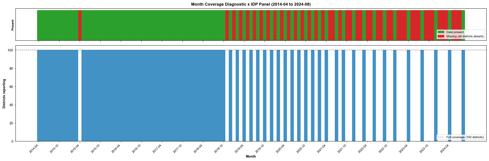
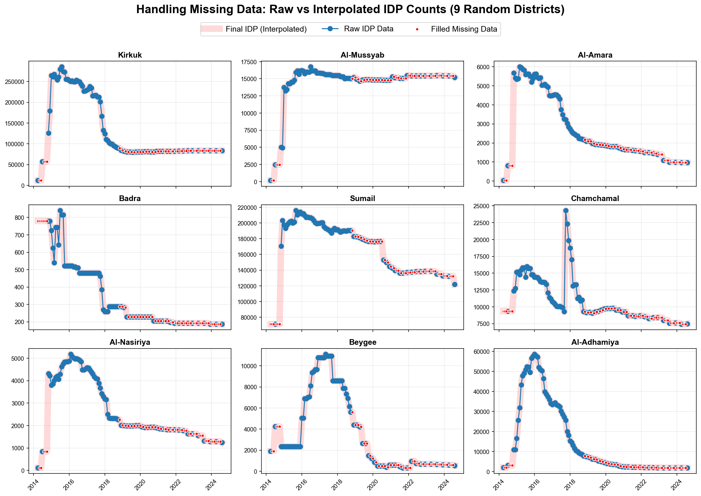
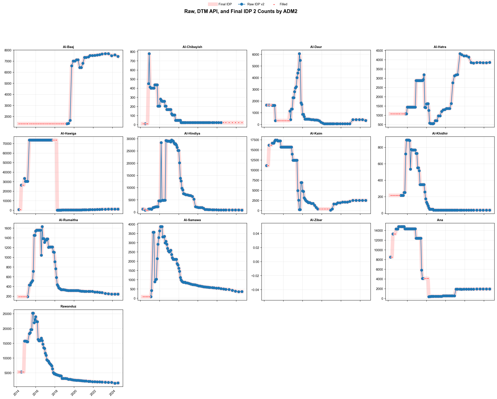
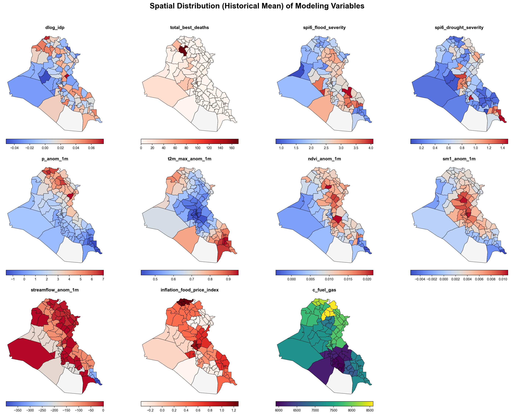
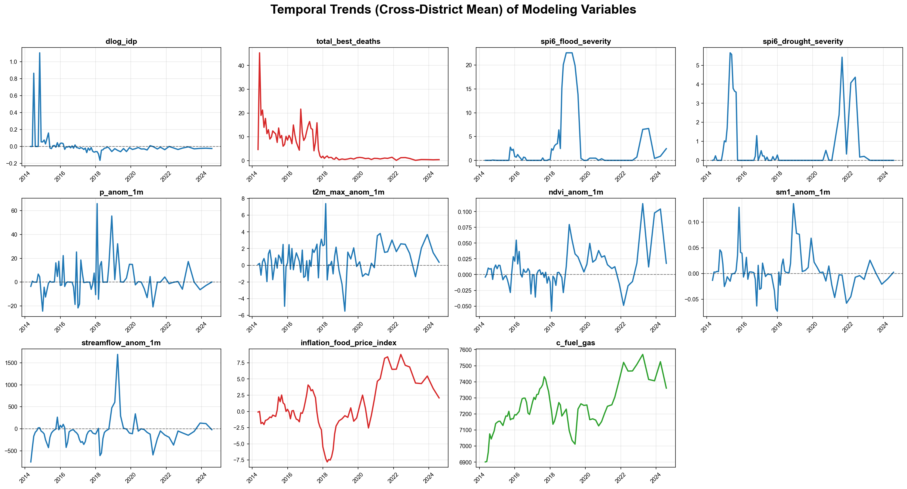
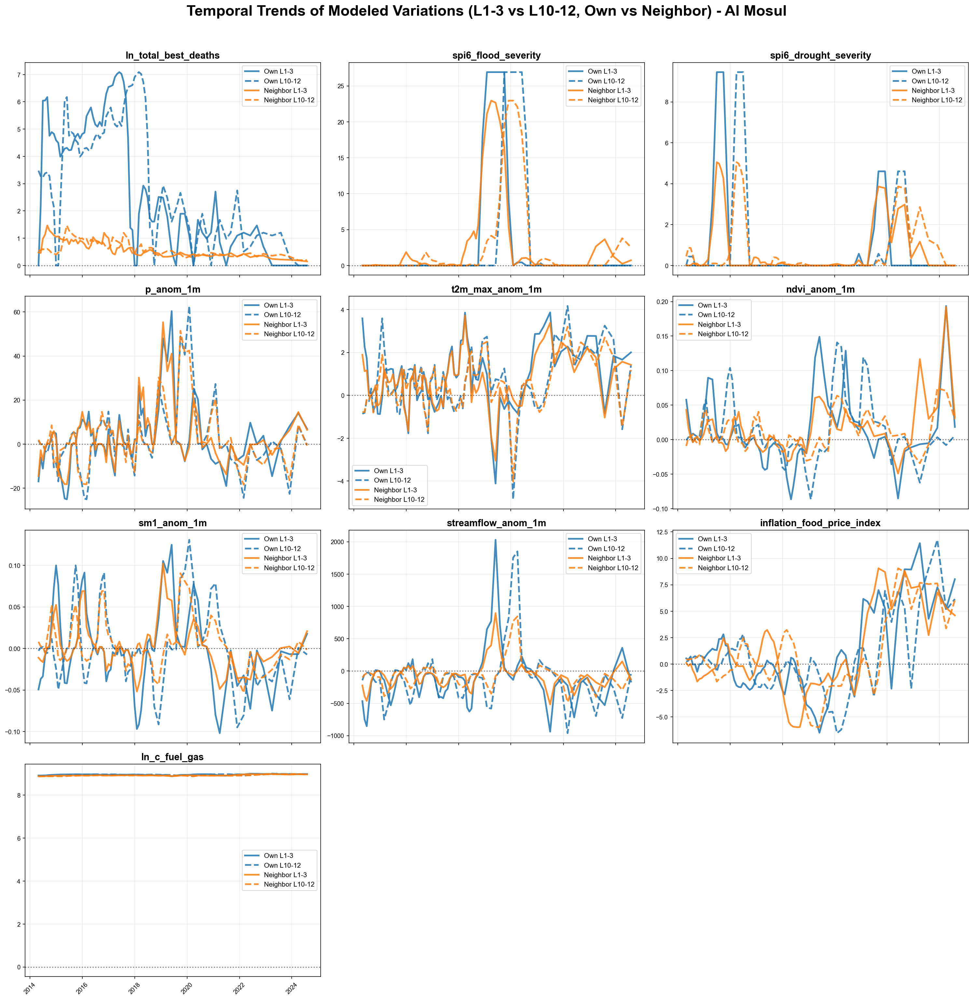
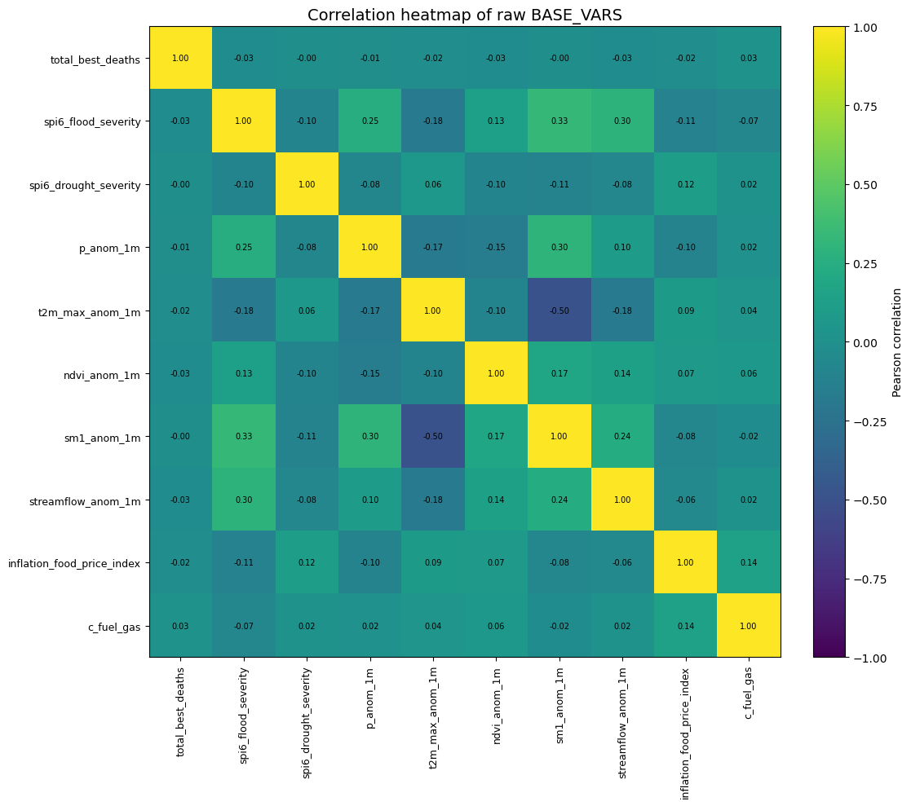
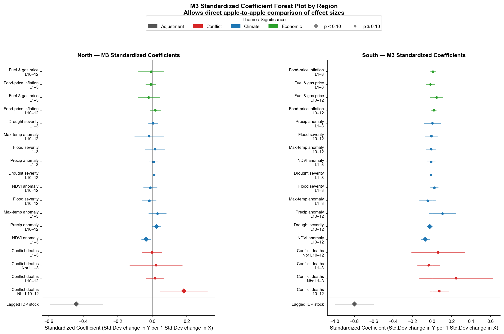
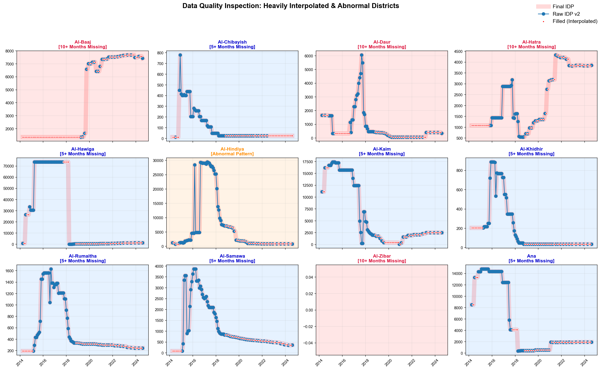
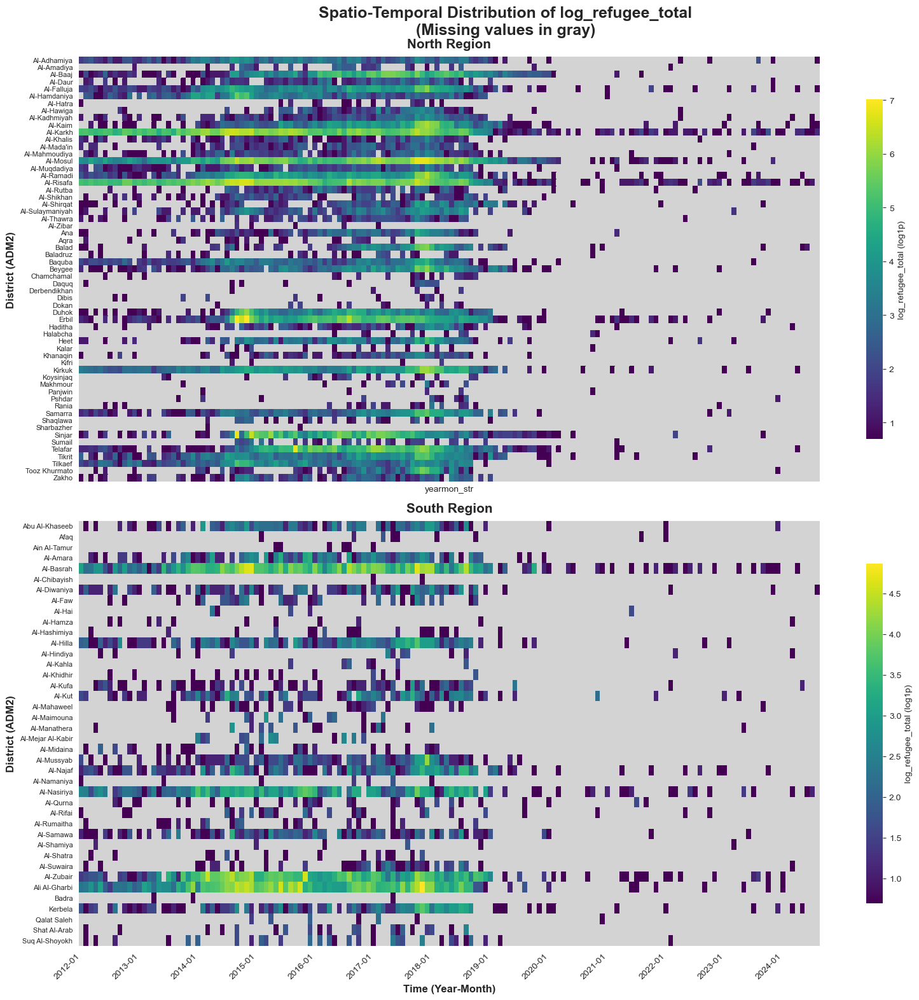

**By:** Manny Kim
**Date:** June 30, 2026

# Part I. Introduction

---

# Slide 1. What drives district-level IDP stock growth rates in Iraq?

> We aim to jointly model the independent and compounding effects of climate anomalies, conflict, and economic shocks on internal displacement dynamics in Iraq.

### *An empirical analysis of conflict, climate, and economic shocks (2014–2024)*

### Research Objectives

1. Build an empirical model explaining monthly IDP stock growth from 2014–2024.
2. Evaluate whether relationships are robust across reasonable model specifications (lags, spatial definitions, functional forms).
3. Discuss how the final empirical model could support future scenario-based projections.

### Figures


**Bottomline**

> We are building a robust empirical model—not necessarily a causal model and not an operational forecasting model.

---

# Slide 2. What are we modelling?

> We model the month-to-month growth of IDP stocks, which captures the net effect of returns, departures, and arrivals, rather than individual migration flows.

> **Monthly growth in the recorded district-level IDP stock**

### Equation

$$
g_{it} = \Delta \ln(\text{IDP}_{it}+1)
$$

Where $g_{it}$ represents the monthly proportional growth rate of the recorded IDP population.

### Important interpretation

This growth reflects the net effect of arrivals, departures, returns, onward movements, and administrative revisions. Therefore, the model explains **growth in recorded IDP stocks**, not individual displacement decisions or migration flows.

> **Implication (What this means in practice):**
> If a district experiences greener-than-usual conditions (a positive NDVI anomaly) and we observe negative IDP stock growth, this does *not* necessarily mean the greenery forced people to migrate *out* of the district. Possible pathways include returns, departures, or reduced arrivals.

### Interpreting Net Stock Growth

Because we model net stocks, one coefficient sign can be explained by two different demographic pathways:

| Model Result                                | Scenario A (Flow In/Out)                                                                    | Scenario B (Retention/Return)                                                                   |
| :------------------------------------------ | :------------------------------------------------------------------------------------------ | :---------------------------------------------------------------------------------------------- |
| **(+) Associated with Stock Growth**  | **Driven by Arrivals (Flow In):** Conditions push people *into* this district.      | **Driven by Retention (Less Return):** Conditions trap existing IDPs, preventing returns. |
| **(-) Associated with Stock Decline** | **Driven by Departures (Flow Out):** Conditions force current IDPs to flee elsewhere. | **Driven by Returns (More Return):** Local conditions improve, facilitating return home.  |

**Why net stocks instead of flows?**

> Ideally, we would explicitly model origin-to-destination flows. However, flow data is inconsistently collected and primarily available only at the larger ADM1 (governorate) scale. To preserve granular district-level (ADM2) analysis, we use net stocks and rely on spatial spillovers (neighbor terms) to account for regional impacts.

### Basis for Scenario Projection

By modeling the *growth rate* relative to the previous month's stock, **the mathematical outcome is naturally recursive**.

> $\text{Stock}_t \approx \text{Stock}_{t-1} \times (1 + g_t)$
> Because next month's stock is a function of this month's stock plus the modeled growth rate, the model naturally supports iterative, month-by-month simulation. This property is what allows us to use this historical model as an engine for projecting future displacement scenarios later in the presentation.

---

# Part II. Data & Model Construction

---

# Slide 3. Outcome Construction & Data Missingness

> Severe temporal gaps in IDP data require interpolation, but we stress-test our findings by removing heavily gap-filled districts to prevent statistical artifacts.

### Construction of the Outcome Variable

* **Source:** IOM Displacement Tracking Matrix (DTM).
* **Harmonization:** We merge overlapping raw records and API data to construct a comprehensive monthly panel per ADM2 district.

### The Missingness Problem & Interpolation

* **Why is data missing?** While early gaps relate to active conflict, the most widespread missingness occurs after October 2018 (2018-10) when overall IDP numbers largely stabilized, leading to less frequent data collection.
* **Interpolation Decision:** Because the IDP trajectories are relatively stable and predictable between the collected months during this period, we decided to linearly interpolate the missing observations to maintain the continuous time-series panel required for our modeling.

#### Visualizing the Gaps and the Fix


**System-wide Missing Months:** Approximately 40% of total calendar months contain system-wide collection gaps, primarily concentrated before 2015 and interspersed intermittently between 2019–2024.


*(Micro-level view showing exactly where raw data (blue) is missing and how it is interpolated (red dots))*

### Methodological Rule: Stress-Testing Modeling Choices

> **Interpolation & Persistence Bias:** Because interpolation affects only a subset of observations and robustness checks explicitly remove heavily interpolated districts, the persistence estimates (e.g., the lagged term) are unlikely to be driven solely by mechanical interpolation.
> *We will explicitly test the robustness of our results later (Slide 10) by completely dropping districts with severe missingness to ensure our findings are not driven by interpolated data.*

---

# Slide 3-1. Identifying Severe Missingness for Later Stress-Testing

> Identifying and flagging districts with prolonged missing data ensures our later robustness checks can explicitly filter out synthetic, interpolated trends.

### Why prolonged gaps matter

When data is missing for extended periods, linear interpolation creates long, flat "synthetic" trends (long red dotted lines) that do not reflect actual on-the-ground dynamics.

### Visualizing Flagged Districts


*(Districts identified with 5+ consecutive months of missing data, showing prolonged artificial flatlines)*

### Implication for the Model

* **The Risk:** Including these heavily interpolated districts could artificially dampen volatility and skew our regression estimates (creating a false sense of stability).
* **The Solution:** We specifically flag districts with prolonged missingness (like the 6-consecutive-month cases shown above) and **drop them entirely** during our robustness checks (Slide 10). This increases confidence that our main findings survive even when these unreliable panels are removed from the sample.

### Summary of Missing Data & Flagged Districts

* **5–9 consecutive missing months:**
  `Al-Chibayish, Al-Hawiga, Al-Kaim, Al-Khidhir, Al-Rumaitha, Al-Samawa, Ana`
* **≥10 consecutive missing months:**
  `Al-Baaj, Al-Daur, Al-Hatra, Al-Zibar(no p-code match)`
* **Other flagged district:**
  `Al-Hindiyah`

---

# Slide 4. Data & Variable Construction

> We integrate high-resolution climate, conflict, and economic data, intentionally excluding neighbor climate variables to avoid severe spatial collinearity.

### Summary of Data & Variables

| Theme              | Indicators                                                                                                                | Spatial Exposure          | Temporal Windows*           |
| :----------------- | :------------------------------------------------------------------------------------------------------------------------ | :------------------------ | :-------------------------- |
| **Outcome**  | IDP Stock Growth ($\Delta \ln(\text{IDP}_{it}+1)$)                                                                      | Own District              | $t$ (Current)             |
| **Conflict** | Conflict Deaths ($\ln(\text{deaths}+1)$)                                                                                | **Own & Connected** | $L_{1-3}$ & $L_{10-12}$ |
| **Climate**  | SPI-6 (Moisture/Flood/Drought)`<br>`Anomalies for Precip, Max Temp, NDVI`<br>`Anomalies for Soil Moisture, Streamflow | **Own District**    | $L_{1-3}$ & $L_{10-12}$ |
| **Economic** | Food-price Inflation (ADM1)`<br>`Fuel & Gas Prices                                                                      | **Own District**    | $L_{1-3}$ & $L_{10-12}$ |

*\* **Temporal Default:** $L_{1-3}$ and $L_{10-12}$ represent **binned averages** over lags 1–3 and 10–12. The simultaneous inclusion of both is our default specification (M3). It is explicitly selected to account for both **short-term acute shocks** (e.g., immediate displacement) and **longer-term persistence** (e.g., compounding stress and delayed migration) simultaneously.*

**Key Modeling Rules:**

* **Conflict Routing:** Connected-district conflict is included to capture violence affecting displacement routes and regional insecurity.
* **Spatial Weight Matrix ($W$):** Constructed using travel-time (friction surface) rather than simple contiguous borders. It captures realistic human mobility networks using an unrestricted ($K=\text{ALL}$) inverse travel-time decay.
* **Climate Collinearity:** Connected-district climate is excluded from the baseline model due to severe spatial collinearity (**Pearson correlation > 0.90**) but is tested later.
* **Anomalies Definition:** Defined as $A_{d,t}=X_{d,t}-\overline{X}_{d,m(t)}$, meaning values represent deviations from a district's own **long-term historical average for that specific calendar month** (e.g., NDVI baseline is 2001–2024). This isolates true climate shocks from expected seasonal weather patterns.

### Spatial Distribution of the Variables



### Temporal Trends of the Variables


*(Temporal trends of all predictors across districts)*

### Temporal Trends of the Variables - (Al-Mosul)


*(Temporal trends of all predictors in Al-Mosul)*

### Correlation Matrix of Key Variables


*(Pearson correlation matrix demonstrating spatial collinearity among climate predictors)*


*(Visual justification for excluding Neighbor climate: Extremely high correlation between Own and Neighbor climate features >0.90)*

```text
Shock
  ↓
Recent exposure (L 1–3)
  ↓
Persistent exposure (L 10–12)
```

*Explain:* Lag windows distinguish recent from persistent effects rather than searching for the best-fitting lag.

---

# Slide 5. Econometric Specification

> We build models sequentially to evaluate two key factors: 1) how much explanatory power each new variable block adds, and 2) how consistent our core results remain across different specifications.

$$
\begin{aligned}
\Delta\ln(\mathrm{IDP}_{d,t}+1)
=\;&\alpha_d+\delta_t
+\rho\ln(\mathrm{IDP}_{d,t-1}+1) \\
&+\sum_{\tau\in\{S,L\}}
\left(
\beta_{\tau}^{C}\text{Conflict}_{d,t-\tau}
+\theta_{\tau}^{C}W\text{Conflict}_{d,t-\tau}
\right)\\
&+\sum_{k\in\mathcal K}\sum_{\tau\in\{S,L\}}
\beta_{k\tau}X_{k,d,t-\tau}
+\varepsilon_{d,t}
\end{aligned}
$$

*(Where $S = L_{1-3}$ and $L = L_{10-12}$ lag windows, $W$ represents the connected-district spatial weights matrix, and $\mathcal{K}$ contains the local climate and economic indicators.)*

### Baseline Adjustment & Persistence

* **Lagged stock ($\ln(\mathrm{IDP}_{d,t-1}+1)$):** Included because humanitarian stocks follow a partial-adjustment model with high persistence, expected in standard stock-flow dynamics.
* **Interpretation:** Other variables explain deviations from the expected inertial stock evolution.

### Fixed Effects

* **District ($\alpha_d$):** Adjusts for time-invariant heterogeneity (e.g., historical wealth, geography).
* **Month ($\delta_t$):** Adjusts for national shocks (e.g., federal policy changes, national economic trends).

### M3 Spec as Baseline

> **Why M3?** The full M3 specification is chosen as the baseline due to **Theory, Interpretability, Parsimony**, and **Stability across robustness tests** (it was *not* chosen simply to maximize $R^2$).

### Right side: Flowchart (Testing Incremental Information)

```text
M0: Base Fixed Effects + Lagged stock
 ↓
M1: + Conflict exposures
 ↓
M2: + Climate anomalies
 ↓
M3: + Economic conditions
```

---

# Slide 6. How should coefficients be interpreted?

> Coefficients represent percentage-point changes in the stock growth rate, showing the speed of displacement rather than absolute headcounts or causal flows.

Because the outcome is the **monthly log growth rate** ($\Delta\ln(\text{IDP}_{it}+1)$), coefficients represent **percentage-point changes in the growth rate**, not absolute headcount changes.

| Variable Type                                                     | Mathematical Meaning                                                                                                                          | Concrete Example (Assuming$\beta = 0.05$)                                                                      |
| :---------------------------------------------------------------- | :-------------------------------------------------------------------------------------------------------------------------------------------- | :--------------------------------------------------------------------------------------------------------------- |
| **Conflict (Logged)**`<br>`$\ln(\text{deaths}+1)$       | **Elasticity-type:** A 10% increase in deaths changes the growth rate by approx $(\beta \times 0.1 \times 100)$ percentage points.    | "A 10% increase in conflict deaths is associated with a**+0.5 percentage point** increase in IDP stock growth."  |
| **Climate Anomaly**`<br>`e.g., $+1^\circ$C or $+1$ mm | **Semi-elasticity (Linear):** A 1-unit increase in the anomaly changes the growth rate by $(\beta \times 100)$ percentage points.     | "A$+1^\circ$C heat anomaly is associated with a **+5.0 percentage point** increase in IDP stock growth." |
| **Economic (Linear)**`<br>`e.g., $+1\%$ Inflation       | **Semi-elasticity (Linear):** A 1-unit increase in price/inflation changes the growth rate by $(\beta \times 100)$ percentage points. | "A 1-point jump in food inflation is associated with a**+5.0 percentage point** increase in IDP stock growth."   |

### What coefficients DO NOT mean

* **NOT Causal Effects:** These are conditional associations, heavily impacted by historical persistence.
* **NOT Absolute Headcounts:** We predict the *speed of growth*, not the exact number of people.
* **NOT Origin-to-Destination Flows:** We model net stocks in a district; we do not know where arriving IDPs came from or where departing IDPs went.

---

# Part III. Results

---

# Slide 7. Which factors are consistently associated with IDP stock growth?

> Displacement is structurally heterogeneous: the North responds strongly to connected conflict and acute agricultural shifts, while the South is driven by chronic environmental degradation.

### Forest Plot


*(Compare effect sizes across North and South regions side-by-side)*

### Core Findings: Signals Consistent Across Specifications

| Region          | Primary Driver               | Timing        | M0 (Block)        | M1 (+Conflict)   | M2 (+Climate)    | M3 (+Econ)       |
| :-------------- | :--------------------------- | :------------ | :---------------- | :--------------- | :--------------- | :--------------- |
| **North** | **Connected Conflict** | $L_{10-12}$ | $+0.248^{***}$  | $+0.227^{***}$ | $+0.216^{***}$ | $+0.217^{***}$ |
| **North** | **NDVI Anomaly**       | $L_{1-3}$   | $-0.419^{***}$  | —               | $-0.379^{***}$ | $-0.375^{***}$ |
| **North** | **Precipitation**      | $L_{10-12}$ | $+0.0013^{***}$ | —               | $+0.0007^{**}$ | $+0.0007^{*}$  |
| **South** | **NDVI Anomaly**       | $L_{10-12}$ | $-0.933^{***}$  | —               | $-0.789^{***}$ | $-0.775^{***}$ |
| **South** | **Drought Severity**   | $L_{10-12}$ | $-0.005^{***}$  | —               | $-0.003^{**}$  | $-0.003^{*}$   |

*(Note: The core environmental and conflict signals remain highly stable in magnitude and direction even as we sequentially condition on additional variable blocks, suggesting that the association is not explained by the included conflict and economic variables.)*

> **Regional Heterogeneity:** There is no single national pattern. The strongest drivers differ between the North and South.

### Estimate Stability across Specifications (M0 → M3)

* **Stable Signals:** The key coefficients (North connected conflict, North/South NDVI, South Drought, and North Precipitation) remain remarkably stable in both magnitude and significance as we step through M0 (Baseline) $\rightarrow$ M1 (Conflict) $\rightarrow$ M2 (Climate) $\rightarrow$ M3 (Economics).
* **Economic Variables:** Inflation and fuel prices show weak or fragile signals once climate and conflict are controlled for, suggesting the primacy of environmental and security shocks.

### Model Fit Statistics (Variance Explained)

To understand how much of the displacement variation is explained by our predictors, we rely on two key metrics:

* **Within $R^2$:** Of the variation left *after* removing permanent district differences and national monthly trends (the fixed effects), how much do our conflict, climate, and economic predictors explain? This is the most stringent and meaningful metric.
* **Two-way FE $R^2$:** Roughly equivalent to Within $R^2$ in our specification, computed over the same demeaned data but using a slightly different denominator for the grand mean. Reported for completeness.
* **Inclusive $R^2$:** Of the *total* raw variation in IDP growth, how much does the *entire* model explain, including the explanatory power of the district and month fixed effects?

| Region | Metric | M0 (Control Only) | M1 (+Conflict) | M2 (+Climate) | M3 (+Econ) |
| :--- | :--- | :--- | :--- | :--- | :--- |
| **North** | Within $R^2$ | 0.039 | 0.052 | 0.048 | 0.048 |
| **North** | Two-way FE $R^2$ | 0.041 | 0.046 | 0.048 | 0.048 |
| **North** | Inclusive $R^2$ | 0.151 | 0.155 | 0.157 | 0.157 |
| **South** | Within $R^2$ | 0.069 | 0.161 | 0.165 | 0.164 |
| **South** | Two-way FE $R^2$ | 0.074 | 0.081 | 0.086 | 0.087 |
| **South** | Inclusive $R^2$ | 0.506 | 0.509 | 0.512 | 0.513 |

> **Note on small $R^2$ values:** A Within $R^2$ of 0.05–0.16 is expected and meaningful in panel models with heavy fixed effects. The fixed effects themselves absorb the vast majority of total IDP variation (e.g., historical wealth or structural differences between districts). What remains is the highly idiosyncratic month-to-month fluctuation, of which our shocks successfully explain a meaningful fraction.

---

# Slide 8. Possible pathways consistent with the empirical results

> Our empirical estimates are consistent with distinct behavioral pathways—such as delayed returns in the North due to regional insecurity, and secondary departures in the South due to environmental stress.

*(Note: The regression estimates net stock growth. The outcome cannot definitively distinguish between fewer arrivals, more departures, or more returns.)*

### The "Northern" Pattern

* **Finding:** Historical *neighboring* conflict ($L_{10-12}$) is positively associated with IDP stock growth.

  * **Econometric Interpretation:** Association retains a stable association after conditioning on local conflict, climate, and economic variables.
  * **Possible Mechanisms:** May reflect continuing arrivals from unstable areas or delayed returns due to regional insecurity.
* **Finding:** Positive NDVI anomalies ($L_{1-3}$) are negatively associated with IDP stock growth.

  * **Econometric Interpretation:** Acute local greening retains a stable association after conditioning on conflict and economic variables.
  * **Possible Mechanisms:** May reflect improved livelihoods enabling returns, or fewer new arrivals.
* **Finding:** Persistent precipitation anomalies ($L_{10-12}$) are positively associated with IDP stock growth.

  * **Econometric Interpretation:** Long-term rainfall maintains a stable positive association across specification blocks.
  * **Possible Mechanisms:** May reflect increased local carrying capacity, allowing existing IDPs to remain in host districts longer.

### The "Southern" Pattern

* **Finding:** Negative long-term NDVI and severe chronic drought ($L_{10-12}$) are negatively associated with IDP stock growth.
  * **Econometric Interpretation:** Chronic environmental stress captures the variance in IDP changes, subsuming independent economic signals.
  * **Possible Mechanisms:** May contribute to secondary departures (resource exhaustion) or delayed returns.

> **Caution:** Interpretations of the Southern dynamics should be made with caution. Displacement data in the South may be less comprehensive than in the North, potentially omitting localized or temporary movements.

---

# Slide 9. Why trust these results?

> We rigorously stress-test the baseline findings across alternative samples, lag structures, and spatial definitions to increase confidence that they are not statistical artifacts.

Could these conclusions simply be artifacts of:

* Lag choice?
* Spatial definitions?
* Data quality?

Let's stress-test the model.

---

# Part IV. Robustness Checks +

---

# Slide 10. Data & Sample Robustness

> The core environmental and conflict signals survive and even strengthen when removing unreliable, heavily interpolated districts.

### Unreliable Districts Identified


*(Districts flagged for high missingness or abnormal patterns)*

### Testing Procedure

We stress-tested the M3 model by progressively dropping districts with high levels of missing or interpolated IDP registry data:

1. **Full Sample** (Baseline)
2. **Drop 10+ missing months** (Moderate restriction)
3. **Drop 5+ missing months** (Strict restriction)
4. **Drop 5+ missing + Known Outlier** (Al-Hindiya)

### Key Findings: The Signals Survive

| Region          | Core Signal (M3)                             | M3 Baseline      | Drop 10+ Missing | Drop 5+ Missing  | Drop Outliers    |
| :-------------- | :------------------------------------------- | :--------------- | :--------------- | :--------------- | :--------------- |
| **North** | **Connected Conflict** ($L_{10-12}$) | $0.217^{***}$  | $0.207^{**}$   | $0.222^{**}$   | $0.222^{**}$   |
| **North** | **Local NDVI** ($L_{1-3}$)           | $-0.375^{***}$ | $-0.456^{***}$ | $-0.519^{***}$ | $-0.519^{***}$ |
| **North** | **Precipitation** ($L_{10-12}$)      | $0.0007^{*}$   | $0.0009^{**}$  | $0.0008^{**}$  | $0.0008^{**}$  |
| **South** | **Local NDVI** ($L_{10-12}$)         | $-0.775^{***}$ | $-0.775^{***}$ | $-0.649^{***}$ | $-0.630^{***}$ |
| **South** | **Drought Severity** ($L_{10-12}$)   | $-0.0036^{*}$  | $-0.0036^{*}$  | $-0.0025$      | $-0.0022$      |

*(Values are coefficients. Outliers = Drop 5+ Missing & Rawanduz)*

> **Conclusion:** The core findings are not statistical artifacts driven by low-quality, heavily interpolated observations. Removing noisy data actually clarifies and strengthens the acute climate signals in the North (both NDVI and Precipitation grow in magnitude and significance). While South Drought loses strict statistical significance in the smallest, most restricted samples, its negative effect direction remains stable.

---

# Slide 11. Alternative temporal assumptions

> The South's displacement is driven by deeply cumulative, persistent resource exhaustion, while the North responds to immediate agricultural shocks.

### Testing Persistent Windows ($L_{10-12}$ vs. $L_{7-9}$)

We tested whether our "chronic" findings depend on the exact 10-12 month window by swapping it with an alternative 7-9 month window, while maintaining the default short-term ($L_{1-3}$) window.

| Region          | Core Signal                               | Default ($L_{1-3}$ & $L_{10-12}$) | Alternative ($L_{1-3}$ & $L_{7-9}$) |
| :-------------- | :---------------------------------------- | :------------------------------------ | :-------------------------------------- |
| **North** | **Connected Conflict** (Persistent) | $0.217^{***}$ (at $L_{10-12}$)    | $0.199^{**}$ (at $L_{7-9}$)         |
| **North** | **Local NDVI** (Acute Shock)        | $-0.375^{***}$ (at $L_{1-3}$)     | $-0.434^{***}$ (at $L_{1-3}$)       |
| **North** | **Precipitation** (Secondary)       | $+0.0007^{*}$ (at $L_{10-12}$)    | $-0.0004$ (at $L_{7-9}$)            |
| **South** | **Local NDVI** (Chronic Decay)      | $-0.775^{***}$ (at $L_{10-12}$)   | $-0.432^{*}$ (at $L_{7-9}$)         |
| **South** | **Drought Severity** (Exhaustion)   | $-0.0036^{*}$ (at $L_{10-12}$)    | $-0.0029^{**}$ (at $L_{7-9}$)       |

### Key Takeaways

1. **Conflict Spillover (North):** The effect of neighboring conflict is nearly identical whether measured at 7-9 or 10-12 months. It is a genuine persistent effect, not a lag artifact.
2. **Acute Shock Stability (North):** The short-term agricultural shock ($L_{1-3}$) remains powerful and stable regardless of which long-term window it is paired with.
3. **Delayed Decay & Exhaustion (South):** Both the agricultural degradation (NDVI) and chronic drought signals are present at 7-9 months ($-0.432^*$ and $-0.0029^{**}$) and carry through to 10-12 months. This is consistent with a delayed response to persistent environmental stress.
4. **Precipitation is Timing-Specific (North):** Unlike the core signals, the North's precipitation signal completely disappears when measured at 7-9 months. This suggests its effect is highly specific to the 10-12 month timeframe and less structurally robust.

---

# Slide 12. Alternative spatial assumptions

> Local climate signals are unaffected by network size, but capturing the true scale of conflict spillover requires broad regional spatial networks.

### Testing Network Size (Travel-Time K-Nearest Neighbors)

We tested whether our findings are sensitive to the size of the spatial network by restricting the travel-time matrix to the top $K=30$ and $K=50$ nearest neighbors, compared to the default unrestricted network ($K=\text{ALL}$).

| Region          | Core Signal                                  | $K=30$         | $K=50$         | Default ($K=\text{ALL}$) |
| :-------------- | :------------------------------------------- | :--------------- | :--------------- | :------------------------- |
| **North** | **Connected Conflict** ($L_{10-12}$) | $0.061^{*}$    | $0.140^{**}$   | $0.218^{***}$            |
| **North** | **Local NDVI** ($L_{1-3}$)           | $-0.391^{***}$ | $-0.375^{***}$ | $-0.376^{***}$           |
| **North** | **Precipitation** ($L_{10-12}$)      | $0.0007^{**}$  | $0.0007^{*}$   | $0.0007^{*}$             |
| **South** | **Local NDVI** ($L_{10-12}$)         | $-0.794^{***}$ | $-0.769^{***}$ | $-0.775^{***}$           |
| **South** | **Drought Severity** ($L_{10-12}$)   | $-0.0032^{*}$  | $-0.0030^{*}$  | $-0.0036^{*}$            |

### Key Takeaways

1. **Local Signals are Immutable:** Local climate coefficients remain remarkably stable across all spatial weight matrices. This increases confidence that they are robust to how we define the spatial network.
2. **Conflict Spillover Requires Broad Networks:** The North's connected conflict signal remains positive and significant across all matrices, but its magnitude and significance grow dramatically as the network expands ($0.061 \rightarrow 0.140 \rightarrow 0.218$). This is consistent with displacement theory: IDP flows are not restricted to immediate neighbors, and artificially cutting off the network at $K=30$ ignores the true, broader regional scale of conflict spillovers.

---

# Slide 13. Alternative Spatial Representations: Regional vs. Relative Local Shocks

> Conflict spillover is fundamentally a regional phenomenon, while agricultural shocks operate strongly at the localized level above and beyond regional trends.

### Definitions

Rather than relying on vague terms, we decompose exposure mathematically:

* $X_i$: Own-district exposure
* $WX_i$: Spatially weighted (connected-district) exposure
* $X_i - WX_i$: Local deviation from the regional environment

**Interpretation:**

* **Regional effect:** A significant coefficient on $WX_i$ (controlling for $X_i - WX_i$) means the broader connected environment is associated with IDP growth.
* **Relative local effect:** A significant coefficient on $X_i - WX_i$ means districts more (or less) exposed than their surrounding region have different IDP growth, conditional on the regional environment.

### Core Signals (Neighbor + Relative Specification)

| Variable                                         | North ($\beta$)                                                     | South ($\beta$)                                                      | Interpretation                                                                                                        |
| :----------------------------------------------- | :-------------------------------------------------------------------- | :--------------------------------------------------------------------- | :-------------------------------------------------------------------------------------------------------------------- |
| **Conflict** ($L_{10-12}$)               | **Reg:** $0.201^{**}$`<br>`**Rel:** $0.004$ (ns)    | **Reg:** $-0.005$ (ns)`<br>`**Rel:** $0.016$ (ns)    | Regional spillover in North. Local conflict relative to neighbors adds little information.                            |
| **NDVI** ($L_{1-3}$ N / $L_{10-12}$ S) | **Reg:** $-0.407$ (ns)`<br>`**Rel:** $-0.357^{**}$  | **Reg:** $-4.198^{***}$`<br>`**Rel:** $-0.612^{**}$  | **North:** Local relative greenness matters more. **South:** Both regional and local contribute.          |
| **Precipitation**                          | **Reg:** $0.0018$ (ns)`<br>`**Rel:** $0.0004$ (ns)  | **Reg:** $0.0072$ (ns)`<br>`**Rel:** $0.0020$ (ns)   | Little evidence once regional and relative effects are separated.                                                     |
| **Drought**                                | **Reg:** $-0.0088$ (ns)`<br>`**Rel:** $0.0025$ (ns) | **Reg:** $-0.0483^{***}$`<br>`**Rel:** $0.0010$ (ns) | Persistent drought operates primarily through regional conditions, not local relative exposure.                       |
| **Food-price Inflation**                   | **Reg:** $-0.0234^{*}$`<br>`**Rel:** $0.0012$ (ns)  | **Reg:** $-0.0120^{**}$`<br>`**Rel:** $0.0025^{***}$ | **North:** Regional markets dominate. **South:** Both regional inflation and local relative price matter. |

### Synthesizing Spatial Processes

| Dominant Spatial Process                      | Variables                                  | Evidence                                                                         |
| :-------------------------------------------- | :----------------------------------------- | :------------------------------------------------------------------------------- |
| **Regional process ($WX$)**           | Conflict (N), Drought (S), Food prices (N) | Districts respond primarily to the broader conditions in connected districts.    |
| **Relative local process ($X - WX$)** | NDVI (N)                                   | Districts differ because they are better or worse than their surrounding region. |
| **Both regional & relative**            | NDVI (S), Food prices (S)                  | Both the shared regional environment and local deviations from it matter.        |
| **No robust spatial process**           | Precip, Flood, Temp, Fuel                  | No robust evidence once both spatial components are modeled jointly.             |

# Slide 14-1. Compound Shocks (Interactions)

> Shocks can multiply; experiencing both recent and historical conflict creates a "conflict trap" that severely amplifies displacement beyond isolated events.

To test whether displacement impacts are amplified when multiple shocks hit simultaneously, we tested theory-driven interactions between core variables.

### Key Significant Interactions

| Interaction Type                          | Interaction Term                                                               | Region                  | $\beta$ (Interaction)                    |
| :---------------------------------------- | :----------------------------------------------------------------------------- | :---------------------- | :----------------------------------------- |
| **Repeated Trauma (Conflict Trap)** | Own Conflict ($L_{1-3}$) $\times$ Own Conflict ($L_{10-12}$)             | **North & South** | $+0.011^{***}$ (N) / $+0.041^{**}$ (S) |
| **Repeated Regional Insecurity**    | Connected Conflict ($L_{1-3}$) $\times$ Connected Conflict ($L_{10-12}$) | **North**         | $+0.015^{*}$                             |
| **Compound Climate Shocks**         | Drought$\times$ NDVI Anomaly ($L_{10-12}$)                                 | **North**         | Significant                                |
| **Extreme Wet Shocks**              | Flood$\times$ Precipitation ($L_{1-3}$)                                    | **South**         | $-0.005^{*}$                             |

### Key Takeaways

1. **The Conflict Trap (Repeated Trauma?):** We pre-specified this interaction expecting that repeated exposure destroys underlying physical infrastructure and social capital, creating a structural "trap". The results support this theory: when a district experiences high conflict *both* recently ($L_{1-3}$) and historically ($L_{10-12}$), the interaction is significantly positive, indicating IDP stocks grow much more than isolated shocks.
2. **Compound Climate Stress:** In the North, the interaction of persistent drought and agricultural degradation (negative NDVI) is associated with amplified stock growth. In the South, compounding wet extremes (floods + precipitation) are associated with accelerated displacement.

---

# Slide 14-2. Functional Form (Nonlinearities)

> Extreme degradation leads to displacement saturation in the South, while acting as sudden tipping points in the North.

To ensure our linear assumptions aren't masking complex thresholds or diminishing effects, we tested squared terms and extreme thresholds for the core variables.

### Key Significant Nonlinearities

| Nonlinearity Test                                       | Region          | Linear Term$\beta$ | Nonlinear/Squared Term$\beta$  |
| :------------------------------------------------------ | :-------------- | :------------------- | :------------------------------- |
| **NDVI Anomaly Squared** ($L_{10-12}$)          | **South** | $-0.758^{***}$     | $-0.005^{**}$ (Concave)        |
| **Own Conflict Squared** ($L_{10-12}$)          | **South** | $+0.054^{***}$     | $-0.025^{***}$ (Concave)       |
| **Extreme Degradation Threshold** ($L_{10-12}$) | **North** | $+0.119$ (ns)      | $+0.039^{**}$ (Threshold Jump) |

*(Note: Threshold tests bottom quartile of NDVI, indicating severe agricultural stress)*


*(Predicted IDP growth curves plotting the concave diminishing effects and threshold jumps)*

### Key Findings

1. **Diminishing Marginal Effects (South):** Both persistent agricultural decay (NDVI) and historical conflict in the South exhibit concave relationships. As NDVI drops, IDP stock surges—but the negative squared term suggests this rate of growth moderates at extreme levels of degradation.
2. **Threshold "Tipping Points" (North):** In the North, normal fluctuations in long-term NDVI ($L_{10-12}$) have no significant linear effect, but crossing an *extreme degradation* threshold triggers a significant jump ($+0.039^{**}$) in IDP stocks.

> **Main conclusion:** The linear specification captures primary trends, while nonlinear diagnostics reveal that Southern displacement saturates at extreme levels, whereas Northern climate impacts function as threshold-based tipping points.

# Slide 15. Synthesis: What have we learned?

> Across all robustness checks, the M3 framework reliably confirms that regional conflict spillovers and local agricultural conditions are the primary, stable drivers of Iraqi displacement.

Our baseline **M3 model** established that internal displacement is heterogeneous, and this narrative holds consistent across all rigorous robustness checks (zero-filling assumptions, lag structures, and spatial networks).

### Summary of Robust Findings

| Finding                              | Evidence (Spatial Process)                       |
| :----------------------------------- | :----------------------------------------------- |
| **Conflict spillover (North)** | **Robust (Regional process)**              |
| **Acute NDVI (North)**         | **Robust (Relative local process)**        |
| **Persistent NDVI (South)**    | **Robust (Regional & Relative process)**   |
| **Precipitation (North)**      | **Fragile (Timing & Spatially sensitive)** |

---

# Slide 16. Conclusions & Limitations

> Internal displacement in Iraq is highly persistent, regionally distinct, and driven by overlapping conflict and climate timelines.

### Conclusions

1. **Regional Heterogeneity:** There is no single national pattern. Northern displacement is sensitive to connected conflict and acute agricultural shifts; Southern displacement responds to chronic environmental degradation.
2. **Timing Matters:** Different exposures act on different timescales ($L_{1-3}$ vs $L_{10-12}$).
3. **Displacement is Persistent:** Stock dynamics are heavily conditioned by prior accumulations, not just acute shocks.
4. **Methodological Contribution:** Demonstrates a transparent, robust empirical framework that integrates climate, conflict, and economic data while navigating severe spatial collinearity.

### Limitations

* **Net stock outcome:** The model estimates net stock growth, meaning it cannot distinguish explicit flows (arrivals vs. departures). This limitation drives the decision to use granular ADM2 stocks alongside spatial neighbor terms.
* **Non-causal:** The model estimates conditional associations, not proven causal mechanisms (due to unobserved time-varying confounders).

---

# Slide 17. Future Work: Scenario Projection

> Because the model predicts monthly stock growth dynamically, it serves as a robust empirical basis for iterative, scenario-based projections.

### Projection Methodology

Because the model predicts monthly stock growth ($g_{it}$) rather than static levels, it can be iteratively applied under alternative future scenarios.

### Concept Flow

```text
Today's IDP stock
         ↓
Predict growth
         ↓
Update stock
         ↓
Predict next month
         ↓
Repeat
```

### Example: Projecting a Regional Conflict Shock (North)

Using the North "Neighbor + Relative" specification coefficient ($\beta = 0.201$) for connected-district conflict deaths ($L_{10-12}$):

* **The Shock:** If connected conflict deaths *double*, $\Delta\ln(\text{deaths}+1) \approx \ln(2) = 0.693$.
* **Growth Prediction:** Predicted monthly IDP-stock growth increases by $0.201 \times 0.693 = 0.139$.
* **Interpretation:** This is approximately a **13.9 percentage-point** higher monthly IDP stock growth.

**Compounding over time (Baseline $Stock_{t=0} = 10,000$):**

* **1 Month Later:** $IDP_1 = (10,000 + 1) \times e^{0.139} - 1 \approx 11,491$ (an additional +1,491 IDPs, holding all else constant).
* **6 Months Later:** If the effect persists, $IDP_6 = (10,000 + 1) \times e^{6 \times 0.139} - 1 \approx 23,029$.

This demonstrates why even a monthly log-growth effect can compound severely over time, capturing the true scale of displacement cascades.

---

# Appendix

* Full regression tables (U1, M0–M3)
* Correlation matrices & VIF tables
* Own vs Neighbor climate collinearity demonstration
* Lag comparisons & Spatial weight sensitivity
* Diagnostics & FE assumptions
* Period-split analysis (Pre-2018 vs Post-2018 differences)

---

# Appendix: External Displacement (Refugee + Asylum Models)

### Shifting Focus to Refugees

While IDPs represent internal displacement dynamics, we also modeled external displacement stocks (**Refugees** and **Asylum Seekers**) using the same empirical framework to understand if they respond to the same push/pull factors.

### Key Findings from the Refugee Model

1. **Climate as a "Pull" Factor:** Unlike IDPs who are pushed out by agricultural degradation (low NDVI), Refugee stocks (`refugee_total`) show a significant positive association with **NDVI anomalies ($+1.758^{**}$)** and a negative association with **temperature anomalies ($-0.048^{**}$)**. This is consistent with refugee populations (often cross-border arrivals) clustering or being hosted in greener, cooler, more hospitable districts.
2. **Conflict Spillover:** Asylum seeker and refugee populations still respond to conflict. Asylum seekers, in particular, are strongly driven by **Connected Conflict ($+30.09^{**}$)**, reflecting the spillover of regional instability.
3. **High Persistence (Stickiness):** The lagged outcome variables ($L_{t-1}$) are extremely strong across the board ($+0.613^{***}$ to $+0.729^{***}$). This suggests refugee populations are highly persistent and static compared to more fluid internal displacement flows.

### Data Quality & Missingness Caveat



As visualized in the missingness heatmap, external displacement datasets suffer from significant temporal and spatial gaps compared to internal IDP tracking. Because our autoregressive specification requires a lagged term ($L_{t-1}$), the empirical results are derived **only from complete-case samples** where a district has valid refugee data at both time $t$ and time $t-1$. This limits the sample size but ensures that the estimated dynamics reflect continuous, observed population changes rather than statistical artifacts from gap-filling.
