# Iraq Displacement Modelling

*Working draft prepared by Chungmann Kim*

*Last updated: 2026-06-09.*

## 1. Introduction (Placeholder)

- **Motivation:** Iraq experienced one of the largest internal displacement crises with peak IDP stocks exceeding xx million during the 2014–2017 Islamic State (IS) conflict.
- **Gap:** Existing literature focuses on conflict as the primary driver.
- **Research question:** How are conflict, climate, and economic conditions associated with IDP accumulation across Iraqi districts, how do these associations differ between the North and South and before and after 2018, and when is a neighboring-district exposure distinguishable from a local exposure?
- **Contribution:**
  - A harmonized district-month panel covering April 2014 to August 2024 (100 districts and 8,100 observations).
  - A diagnostics-guided core indicator set that limits redundant measures within each thematic domain.
  - Fixed short-term ($L_{1-3}$) and long-term ($L_{10-12}$) exposure windows, avoiding multicollinearity.
  - A spatial specification: conflict is represented by all four own/spatial and short/long variations, while climate and food-price indicators enter as own-district exposures only because their own and spatial versions are highly correlated - multicollinearity.
  - Regional and pre/post-2018 comparisons interpreted as conditional associations rather than causal effects.

---

## 2. Background (Placeholder)

### Iraq context (Sani's input needed)
- Post‑2003 political fragmentation and state fragility.
- 2014 IS territorial expansion triggered mass internal displacement; peak IDP stocks were ~3.4 million in 2014
- Geography: KRI as a major receiver, IS‑affected governorates (Ninewa, Anbar, Salah al‑Din, Kirkuk, Diyala) as primary origins.
- Economy: oil‑dependent revenues, fragmented labor markets, and household exposure to fuel/food subsidy changes?
- Climate: largely arid/semi‑arid?

### Literature notes
- Conflict–displacement: works related to conflict is a principal push factor, but few studies use subnational panel designs
- Climate–displacement: drought, heat, and crop shocks link to mobility?
- Spatial spillovers: neighboring shocks shape local displacement decisions and motivate spatial lag specifications?
- Iraq evidence: extensive operational reporting (IOM, UNHCR, ICG) but limited econometric ADM2 panel analyses
- Gap this paper fills: a district‑month FE panel with travel‑time spatial weights, simultaneous conflict/climate/economic channels, and a pre/post‑2018 regime comparison
---

## 3. Conceptual Framework (Placeholder)

### Mechanisms

Displacement decisions emerge from the intersection of three broad categories stress: physical insecurity arising from armed conflict, livelihood disruption driven by climate variability or weather shocks (e.g. drought and flood), and erosion of market access reflected in food and fuel price movements. They tend to interact to shape whether and when households choose—or are forced—to leave their place of origin.

### Spatial Spillovers

What motivates our the empirical design is that displacement decisions are not confined to the conditions prevailing within a household's own district. Shocks originating in neighboring administrative units can affect local mobility.

---

## 4. Study design

### 4.1 Unit of analysis
- The unit of analysis is the ADM2 district-month.
- The analytical window spans April 2014 to August 2024.
- After harmonization to a common ADM2 P-code framework, the working panel contains 100 districts and 8,100 district-month observations.
  - Al-Salman is excluded because no IDP data are available.
  - Months with no usable data across districts are dropped from the estimation sample; Appendix Figure A1a shows the month-coverage diagnostic that motivates this restriction.

### 4.2 Outcomes (IDP focus)
- The primary outcome is logged IDP stock, $\ln(\mathrm{IDP}_{d,t}+1)$.
- IDP stock data are drawn from IOM DTM, with values prioritized in the order $\mathrm{raw}>\mathrm{API}>\mathrm{interpolated}$.
- A secondary outcome, $\Delta\ln(\mathrm{IDP}+1)$, captures the month-to-month change in $\ln(\mathrm{IDP}+1)$ and is used to approximate short-run flow dynamics.
- Additional outcomes, including returnee and refugee measures, will be incorporated in later iterations once those series are finalized.

### 4.3 Spatial logic
- The own-district term captures the association between $X_{d,t-\tau}$ and IDP stock in district $d$.
- The neighbor term captures the association between the travel-time-weighted average $(WX)_{d,t-\tau}$ and IDP stock in district $d$.
- These two terms are not included mechanically for every indicator. Conflict deaths retain both own and neighboring exposures because violence in a district and violence in connected districts represent distinct plausible channels.
- Climate and economic indicators enter through own-district exposures only. Their spatial lags closely track their own-district values, making simultaneous inclusion difficult to identify and potentially unstable.

### 4.4 Temporal logic
- Short-term exposure is defined as the mean of lags 1–3 months ($L_{1-3}$).
- Long-term exposure is defined as the mean of lags 10–12 months ($L_{10-12}$).
- The same two windows are fixed across indicators, regions, and sample periods. Intermediate windows ($L_{4-6}$ and $L_{7-9}$) are used only in diagnostics.
- Fixing these windows before comparing results reduces specification search and avoids estimating four highly related lag blocks for every indicator.

### 4.5 Spatial weights matrix ($W$)
- The spatial weights matrix is constructed from the Iraq road network (drive) using OSMnx.
- ADM2 centroids are snapped to network nodes, and shortest-path travel times are computed between districts.
- Travel times are converted to proximity weights using $w_{ij}=1/T_{ij}$, truncated to the $k$ nearest neighbors, and then row-normalized.
- The main specification uses $K=30$; robustness checks use $K=50$ and $K=\mathrm{ALL}$.

> **Figure 1.** Iraq administrative districts (ADM2) by North/South classifications.

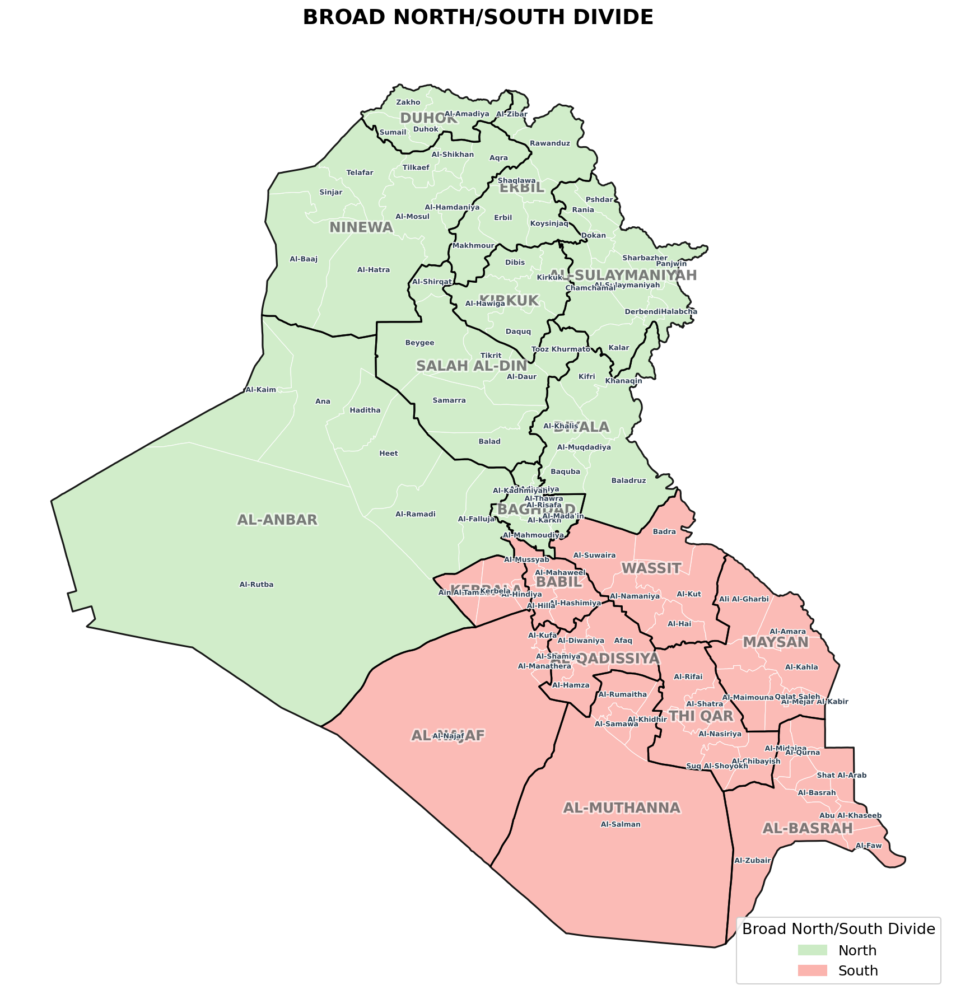

*Note: The figure illustrates the North/South distinction used for stratification. Models use the regional split listed below ("South" vs "Central & North").*

### 4.6 Regional stratification

Models are estimated separately for two regional groups (ref. Mac Skelton):

- **South (9 governorates):** Wassit, Thi Qar, Al‑Basrah, Al‑Muthanna, Al‑Najaf, Maysan, Al‑Qadissiya, Kerbala, Babil
- **Central & North (9 governorates):** Ninewa, Al‑Anbar, Salah al‑Din, Kirkuk, Diyala, Baghdad, Duhok, Erbil, Al‑Sulaymaniyah

*The figure above illustrates the North/South distinction used for the analysis.*

---

## 5. Data Overview

### 5.1 Outcome Variables

**Table 1. Outcome Variables**

| Variable | Source | Definition | Obs | Coverage |
|----------|--------|-----------|-----|----------|
| IDP Stock | IOM DTM (raw + API) | $\ln(\mathrm{IDP}+1)$ | District-month | Apr 2014 – Aug 2024 |
| IDP Change  | IOM DTM | Month-over-month $\Delta\ln(\mathrm{IDP}+1)$ | District-month | Apr 2014 – Aug 2024 |
| Returnee Stock  | UNHCR / IOM DTM | $\ln(\mathrm{returnee}+1)$ | District-month | Partial 2017–2024 |
| Returnee Change  | UNHCR / IOM DTM | Month-over-month $\Delta\ln(\mathrm{returnee}+1)$ | District-month | Partial 2017–2024 |

*Note: IDP records reconciled from two overlapping sources (raw DTM + API) via hierarchical priority rule: raw hand-coded values preferred, then API values, then linear interpolation for residual gaps.*

### 5.2 Conflict Measures

- Georeferenced event data from UCDP [CITE: UCDP GED, Sundberg & Melander 2013], aggregated to district-month level
- Key variables: total battle-related deaths, total conflict events
- Zero-conflict months assigned 0 (not missing) - 13 districts; entered as $\ln(x+1)$ in main specs

### 5.3 Climate Measures

- **SPI-6** [CITE: McKee et al. 1993]: Standardized Precipitation Index (6-month), from CHIRPS [CITE: Funk et al. 2015]; values $<-1.3$ indicate drought and values $>+1.3$ indicate excess moisture
- **Temperature anomaly**: Monthly maximum temperature deviation from long-run calendar-month mean, ERA5-Land [CITE: Hersbach et al. 2020]
- **NDVI anomaly**: Vegetation greenness deviation from baseline, MODIS [CITE: Didan 2015]
- **Soil moisture anomaly**: Top-layer soil moisture deviation, ERA5-Land

### 5.4 Economic Measures

- **Food price inflation**: month-over-month % change in district-level food price basket [CITE: WB price estiamtes, Bo Andree]
- **Fuel gas price** (log-transformed): examined during indicator screening but excluded from the final core model because its short- and long-window measures are highly persistent and add limited independent information [CITE: WB price estimates, Bo Andree].

### 5.5 Descriptive Statistics

**Table 2. Key Descriptive Statistics by Region** *(Apr 2014 – Aug 2024)*

| Variable | North Mean (SD) | North Coverage | South Mean (SD) | South Coverage |
|----------|----------------|---------------|----------------|---------------|
| IDP stock (raw count) | 33,697 (60,357) | 99.6% | 4,377 (10,269) | 100% |
| Conflict deaths | 10.4 (63.7) | 100% | 0.5 (9.9) | 100% |
| Conflict events | 0.71 (3.00) | 100% | 0.02 (0.17) | 100% |
| SPI-6 | 0.27 (1.11) | 100% | 0.26 (1.12) | 100% |
| Temperature anomaly (max, °C) | 0.62 (2.04) | 100% | 0.72 (2.10) | 100% |
| NDVI anomaly | 0.010 (0.046) | 100% | 0.008 (0.029) | 100% |
| Soil moisture anomaly | 0.004 (0.044) | 100% | 0.002 (0.038) | 100% |
| Flood severity (SPI-based) | 2.25 (6.10) | 100% | 2.56 (6.91) | 100% |
| Drought severity (SPI-based) | 0.62 (2.33) | 100% | 0.56 (2.27) | 100% |
| Food price inflation (%) | 0.36 (5.57) | 100% | 0.21 (6.11) | 100% |
| Fuel gas price | 7,743 (647) | 100% | 6,502 (617) | 100% |

*$N=4{,}860$ obs (60 districts × 81 months) for North; $N=3{,}240$ obs (40 districts × 81 months) for South. Full distributional statistics in Appendix Table A1.*

### 5.6 Spatiotemporal Patterns

> **Figure 2.** IDP stock dynamics 2014–2024, by region. Mean $\ln(\mathrm{IDP}+1)$ across districts by month, with $\pm 1$ SD band and individual district traces. Dashed vertical line marks the 2018 structural break.

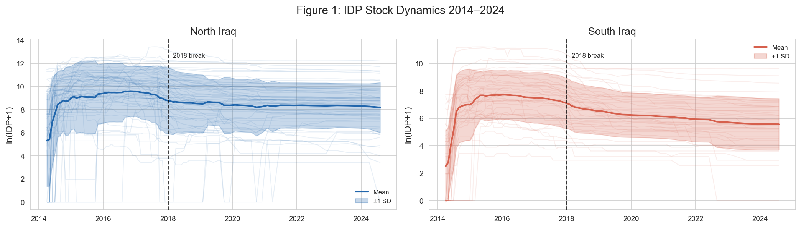

- **North:** Pronounced peak in 2014–2016 (IS occupation); gradual decline through 2019; stabilization post-2020. High between-district variance throughout
- **South:** Lower baseline, more diffuse temporal variation, continued idp resolvement post-2018
- The 2017(2016-2018) break is visually clear in the North time series and motivates the pre/post regime split

> **Figure 3.** Conflict indicators (e.g., conflict events, conflict-induced deaths, conflict incidences) by district and month, North vs South. Rows = ADM2 districts (grouped by governorate); columns = months. YlOrRd colormap; gray = no data.

- **North:** Geographically concentrated conflict intensity in 2014–2017, particularly in Ninewa, Salah Al-Din, Anbar, Kirkuk, and Diyala. Few changes in volume Post 2018 with some reported deaths in Duhok and Erbil.
- **South:** Sparse and episodic conflict throughout; no sustained high-intensity periods
- The geographic and temporal differences between North and South supports the regional stratification decision

---

## 6. Data Handling and Measurement

### 6.1 Harmonization: P-Code Alignment

All data sources were unified to a common ADM2 geographic reference by constructing a master district list from Iraq P-codes combined with GeoBoundaries shapefiles [CITE: GeoBoundaries]. Each source was cross-walked to this master list, with naming inconsistencies resolved through exact and fuzzy string matching followed by manual review.

### 6.2 IDP Reconciliation (Raw vs. API)

IDP records were classified as: exact match, minor mismatch, major mismatch, source-specific absence. Priority rule applied: raw hand-coded values → API values → linear interpolation within district.

### 6.3 Outcome Transformations

- $\ln(\mathrm{IDP}+1)$ — accounts for zeros; percentage-change interpretation of coefficients
- $\Delta\ln(\mathrm{IDP}_{d,t}+1)=\ln(\mathrm{IDP}_{d,t}+1)-\ln(\mathrm{IDP}_{d,t-1}+1)$ — isolates monthly flow dynamics; differences out time-invariant district characteristics

### 6.4 Temporal Lag Construction

Lagged predictors were initially constructed for $L_{1-3}$, $L_{4-6}$, $L_{7-9}$, and $L_{10-12}$ as quarterly-block averages, requiring all component lags to be non-missing. The confirmatory specification retains only:

- $L_{1-3}$: short-term exposure over the preceding quarter
- $L_{10-12}$: longer-term exposure approximately one year earlier

The two-window structure is applied uniformly and is not selected separately for each predictor.

### 6.5 Core Indicator Selection and Collinearity Diagnostics

The core indicator set was selected in two stages. First, candidate measures within each thematic domain were compared using pairwise correlation matrices and substantive interpretability. This reduced multiple closely related conflict, precipitation, temperature, soil-moisture, and price measures to one measure per intended construct where possible. The final set contains logged conflict deaths; SPI-based flood severity; SPI-based drought severity; maximum-temperature anomaly; NDVI anomaly; top-layer soil-moisture anomaly; and food-price inflation.

Second, correlations were examined across the exact model columns: own and spatial exposures at $L_{1-3}$ and $L_{10-12}$, separately by region. The strongest correlations generally occurred between the own and spatial versions of the same climate indicator. For example, own/spatial correlations were approximately $0.93$-$0.94$ for maximum-temperature anomaly, $0.90$-$0.93$ for flood severity, and $0.87$-$0.91$ for soil moisture. These diagnostics motivated excluding spatial climate terms. Food-price spatial lags were also strongly correlated with own-district prices, consistent with broad market co-movement.

After applying the reduced indicator set and spatial policy, no final model specification had a variance inflation factor above 10. Correlation screening and VIF checks reduce, but do not eliminate, uncertainty caused by related environmental indicators and lag windows.

### 6.6 Spatial Lag Construction

For any district-level variable $X$, the spatial lag is defined as:

$$
WX_{d,t} = \sum_{j \neq d} W_{dj} \cdot X_{j,t}
$$

In practice, spatial lags are computed through matrix multiplication, $\mathbf{WX} = \mathbf{W} \times \mathbf{X}$, after reshaping each variable into a district-by-month matrix and then converting the result back to long format. The same lag windows used for own-district covariates are applied to the spatial lag terms so that local and neighboring exposures remain directly comparable across specifications.

| Figure a. Drivable road network of Iraq | Figure b. Example spatial connectivity from Al-Basrah |
|---|---|
| 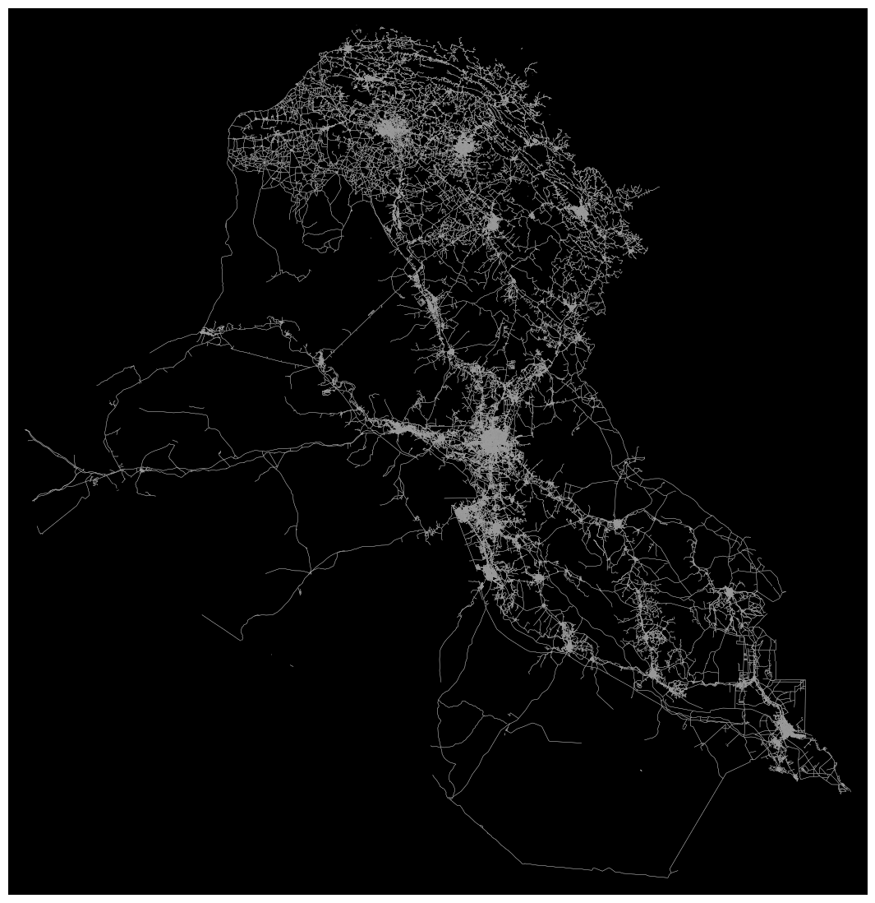 | 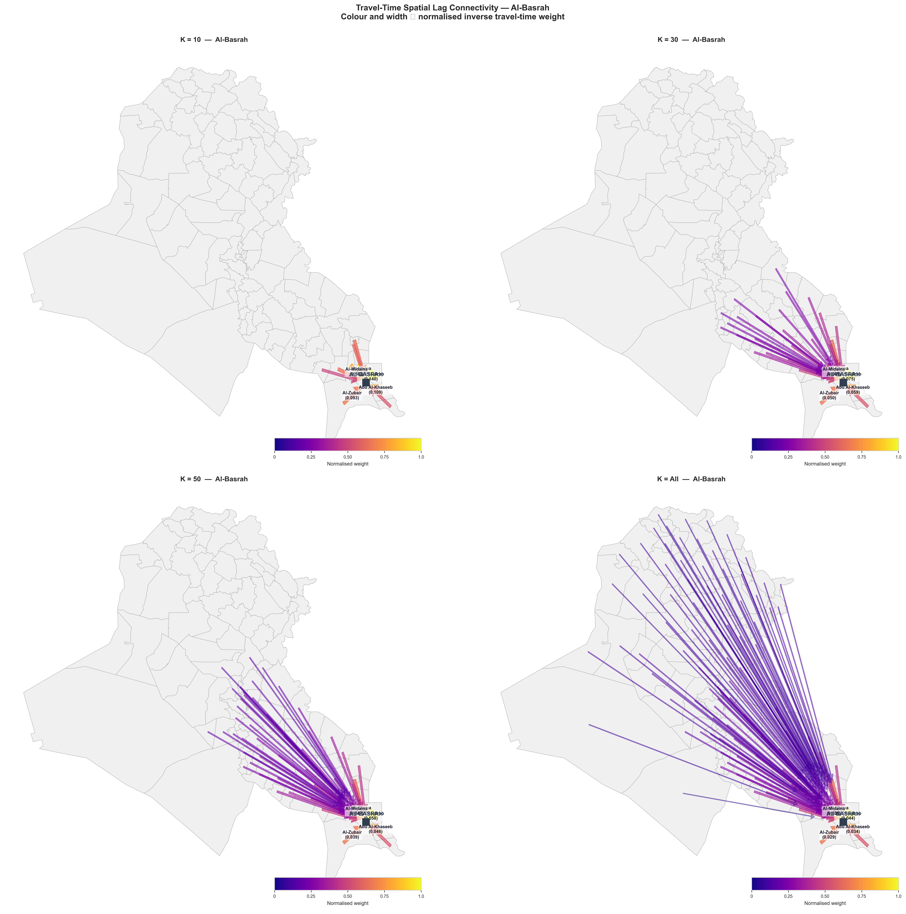 |
| *The national drivable road network extracted from OpenStreetMap using OSMnx. This network provides the basis for computing shortest-path travel times between ADM2 district centroids and, in turn, the spatial weights matrix $W$.* | *This figure illustrates how the travel-time-based spatial weights matrix links Al-Basrah to neighboring districts under different values of $K$. Arrow width and intensity reflect normalized inverse travel-time weights, showing how the effective neighborhood expands as more connected districts are retained.* |

---

## 7. Empirical Strategy

### 7.1 Main Specification

The empirical analysis uses a dynamic two-way fixed-effects panel model. The main outcome is logged IDP stock, and the model includes its one-reporting-period lag to account for the strong persistence of displacement stocks. All models include district and month fixed effects, with standard errors clustered by district.

$$
\ln(\text{IDP}_{d,t}) =
\alpha_d + \lambda_t + \rho \ln(\text{IDP})_{d,t-1}
+ \sum_{\tau \in \{S,L\}}
\left(
\beta_{\tau}^{C,own} C_{d,t-\tau}
+ \theta_{\tau}^{C,neigh} WC_{d,t-\tau}
\right)
+ \sum_{k \in \mathcal{K}}\sum_{\tau \in \{S,L\}}
\beta_{k\tau}^{own}X_{k,d,t-\tau}
+ \epsilon_{d,t}
$$

where:

- $d$ indexes districts and $t$ indexes months.
- $\alpha_d$ and $\lambda_t$ are district and month fixed effects.
- $S$ denotes $L_{1-3}$ and $L$ denotes $L_{10-12}$.
- $C$ is logged conflict deaths. Conflict enters as own-short, own-long, neighbor-short, and neighbor-long exposures.
- $\mathcal{K}$ contains flood severity, drought severity, maximum-temperature anomaly, NDVI anomaly, top-layer soil-moisture anomaly, and food-price inflation. These enter as own-district short- and long-term exposures only.
- $W$ is the row-normalized inverse-travel-time weights matrix.
- $\epsilon_{d,t}$ is the error term.

The coefficients are interpreted as conditional associations. The design does not establish that a change in an exposure caused a change in displacement.

### 7.2 Fixed Lag and Spatial Lag

The specification follows two pre-defined rules:

- **Fixed temporal Rule:** every indicator is represented at $L_{1-3}$ and $L_{10-12}$.
- **Selective spatial Rule:** conflict retains all four variations because local and neighboring violence are substantively distinct. Climate and food-price indicators retain own-district terms only because their own and spatial versions are highly correlated and the local exposure is more directly interpretable.

This rule limits the number of correlated regressors and prevents the interpretation of a spatial coefficient that is identified mainly by small differences between nearly identical local and neighboring series.

### 7.3 Sequential Model Blocks

- **M0 (Persistence):** one-reporting-period lagged logged IDP stock.
- **M1 (+ Conflict):** M0 plus the four conflict variations.
- **M2 (+ Climate):** M1 plus own-district short- and long-term climate indicators.
- **M3 (+ Economic):** M2 plus own-district short- and long-term food-price inflation.

M3 is the full model. Changes in within-$R^2$ across blocks are descriptive comparisons, not formal decompositions of causal contribution.

### 7.4 Regional Stratification and Sample Splits

All models are estimated separately for North and South Iraq.

For each region, three samples are considered:

- **Pooled:** April 2014 to August 2024
- **Pre-break:** April 2014 to December 2017
- **Post-break:** January 2018 to August 2024

The January 2018 break is motivated by the near-complete territorial defeat of IS and the sharp decline in conflict intensity visible in Figure 3.

The split is a descriptive periodization motivated by the decline of IS territorial control and conflict intensity. It should not be interpreted as a quasi-experimental intervention date.

### 7.5 Dynamic Panel Considerations

The lagged outcome coefficient is high ($0.874$ in the North and $0.892$ in the South in pooled M3 models), reflecting strong IDP-stock persistence. With 81 periods, the approximate Nickell bias is small relative to the fixed-effects estimate (about $-0.023$, or $-2.7\%$).

---

## 8. Robustness and Model Extensions

- **Alternative spatial neighborhoods:** $K=30$ is the main specification; $K=50$ and all connected districts are sensitivity checks.
- **Alternative lag windows:** all four quarterly lag blocks are plotted as coefficient-stability diagnostics, while the main tables retain only $L_{1-3}$ and $L_{10-12}$.
- **Change outcome:** models are repeated for $\Delta\ln(\mathrm{IDP}+1)$. Their within-$R^2$ is near zero or negative in most cells, indicating weak fit for month-to-month changes.

### 8.1 Random-Forest Screening

Separate random forests were estimated for the pooled North and South samples after applying a two-way within transformation to the outcome and predictors. Each model used the same 17 features as the M3 specification: lagged logged IDP stock; four conflict exposures; and short- and long-window own-district measures for five climate indicators and food-price inflation. The forests used 300 trees, square-root feature sampling, and a minimum terminal-node size of 20.

The RF analysis was used only as a screening device. For each feature, one-dimensional partial-dependence and individual-conditional-expectation curves were calculated over a 50-point grid. A nonlinearity score measured the deviation of the partial-dependence curve from its best linear approximation relative to the curve's range. Features were nominated by combining this score with RF feature importance. Pairwise Friedman-style H-statistics were also calculated over a 15-by-15 grid for the eight highest-importance features in each region, with $H>0.10$ treated as a possible interaction signal.

These diagnostics are not validation tests. The reported RF $R^2$ is in-sample, impurity-based feature importance can be divided or distorted among correlated predictors, and partial dependence can evaluate combinations of correlated exposures that are sparse or absent in the observed data. The screening therefore identifies shapes worth examining, not stable functional forms or causal response relationships.

### 8.2 Threshold and Interaction Checks

Two follow-up exercises translated selected RF patterns back into the fixed-effects framework:

1. **Threshold models (M4):** Three candidate variables per region were converted into indicators for values above the 75th percentile of their two-way-demeaned distributions. In the North, the candidates were short-window food inflation, short-window drought severity, and long-window soil moisture. In the South, they were short- and long-window food inflation and long-window flood severity. Each threshold was added separately and all three were then added jointly to M3.
2. **Interaction models (M5):** Four pairwise products were tested in pooled models: short-window own conflict by short-window drought and by short-window food inflation in the North, and long-window flood by long-window NDVI and by long-window soil moisture in the South.

The thresholds and interactions were exploratory rather than pre-specified. They were nominated and tested using the same observations, no holdout sample or multiplicity correction was used, and the 75th-percentile threshold was a convenient operational choice rather than an externally established substantive cutoff. In addition, the interaction pairs tested in M5 do not all coincide with the highest H-statistic pairs in the latest RF run, reflecting candidate-selection drift across notebook iterations. This weakens their reproducibility and is an additional reason not to treat them as confirmatory results.

---

## 9. Results

### 9.1 Descriptive: IDP Stock Dynamics

- North Iraq IDP stock peaked in late 2014–early 2016, corresponding to the IS territorial expansion [CITE: IOM DTM 2014–2016 reports]
- Mean $\ln(\mathrm{IDP}+1)$ in the North is approximately $5\times$ higher than the South over the pooled period (raw mean: 33,697 vs. 4,377)
- The 2018 structural break is clearly visible in the North time series: a sharp inflection point corresponding to IS defeat and early-phase return movements
- Post-2018 North dynamics show partial stabilization, not monotonic return — consistent with protracted displacement literature [CITE: Jacobsen / UNHCR protracted displacement]
- South shows low but persistent IDP levels throughout, with modest post-2018 accumulation — likely driven by secondary displacement from the North and climate-induced livelihood shocks

### 9.2 Collinearity Diagnostics and Model Fit

The correlation review supports the selective spatial policy. Own and neighboring versions of the same climate indicators are often nearly interchangeable: the correlations reach $0.94$ for temperature, $0.93$ for flood severity, $0.91$ for soil moisture, and $0.84$ for NDVI. By contrast, the final policy-aware models have no VIF values above 10.

**Table 3. Model progression, persistence, and full-model fit**

| Region | Sample | $N$ | M0: persistence | M1: + conflict | M2: + climate | M3: + economic | $\Delta R^2_{\mathrm{M0\rightarrow M3}}$ | M3 lagged-IDP coefficient (SE) | M3 change-outcome within-$R^2$ |
|---|---|---:|---:|---:|---:|---:|---:|---:|---:|
| North | Pooled | 4,800 | 0.839 | 0.840 | 0.835 | 0.835 | -0.004 | 0.8736 (0.0249) | -0.060 |
| South | Pooled | 3,200 | 0.897 | 0.901 | 0.901 | 0.901 | +0.004 | 0.8915 (0.0193) | -0.002 |
| North | Pre-2018 | 2,580 | 0.776 | 0.776 | 0.769 | 0.768 | -0.008 | 0.8138 (0.0311) | -0.049 |
| South | Pre-2018 | 1,720 | 0.871 | 0.872 | 0.873 | 0.874 | +0.003 | 0.8421 (0.0383) | 0.022 |
| North | Post-2018 | 2,280 | 0.826 | 0.826 | 0.823 | 0.823 | -0.003 | 0.8921 (0.0399) | -0.026 |
| South | Post-2018 | 1,520 | 0.950 | 0.949 | 0.948 | 0.947 | -0.003 | 0.9441 (0.0089) | -0.043 |

*Notes: M0 includes lagged logged IDP stock; M1 adds the four conflict exposures; M2 adds own-district climate exposures; and M3 adds own-district food-price inflation. All specifications include district and month fixed effects, with standard errors clustered by district. The first four model columns report within-$R^2$ for logged IDP stock. The final column reports within-$R^2$ for the M3 change-outcome model, which does not include lagged IDP stock. The reported within-$R^2$ is not used as a formal decomposition of thematic contributions and need not increase across the two-way fixed-effects specifications.*

The high lagged-IDP coefficients show that the stock outcome is strongly persistent. Relative to M0, the full M3 specification changes within-$R^2$ by less than one percentage point in every regional-period sample. The change-outcome models have near-zero or negative within-$R^2$ in five of six samples, so the main interpretation centers on logged IDP stock rather than short-run changes.

### 9.3 Main M3 Associations

**Table 4. M3 exposure associations with logged IDP stock ($p<0.05$)**

| Region | Sample | Theme | Indicator | Exposure | Window | Coefficient (SE) | $p$-value |
|---|---|---|---|---|---|---:|---:|
| North | Pooled | Conflict | Logged conflict deaths | Neighboring districts | $L_{10-12}$ | 0.1753 (0.0596) | 0.003 |
| North | Pooled | Climate | Maximum-temperature anomaly | Own district | $L_{1-3}$ | 0.0509 (0.0130) | <0.001 |
| North | Pooled | Climate | NDVI anomaly | Own district | $L_{10-12}$ | -1.4390 (0.5855) | 0.014 |
| North | Pooled | Climate | Soil-moisture anomaly | Own district | $L_{10-12}$ | 1.5183 (0.5375) | 0.005 |
| South | Pooled | Conflict | Logged conflict deaths | Own district | $L_{1-3}$ | -0.0340 (0.0152) | 0.025 |
| South | Pooled | Conflict | Logged conflict deaths | Neighboring districts | $L_{10-12}$ | 0.1525 (0.0627) | 0.015 |
| North | Pre-2018 | Climate | Maximum-temperature anomaly | Own district | $L_{1-3}$ | 0.1035 (0.0272) | <0.001 |
| North | Pre-2018 | Climate | NDVI anomaly | Own district | $L_{10-12}$ | -2.8819 (1.1731) | 0.014 |
| North | Pre-2018 | Climate | Soil-moisture anomaly | Own district | $L_{10-12}$ | 1.7245 (0.8508) | 0.043 |
| South | Pre-2018 | Climate | Flood severity | Own district | $L_{10-12}$ | -0.0245 (0.0071) | 0.001 |
| South | Post-2018 | Economic | Food-price inflation | Own district | $L_{1-3}$ | 0.0009 (0.0004) | 0.020 |
| South | Post-2018 | Economic | Food-price inflation | Own district | $L_{10-12}$ | 0.0014 (0.0005) | 0.005 |

*Notes: The table reports every exposure coefficient from the M3 logged-stock models with $p<0.05$; it is not a substantively selected subset. Coefficients are unstandardized, and standard errors clustered by district are shown in parentheses. The lagged-IDP coefficient is reported in Table 3. Full coefficient tables, including estimates that do not meet this threshold and all change-outcome results, are provided in Appendix Tables A2-A5.*

These estimates are conditional associations rather than causal effects. Their signs and statistical precision vary across regions and periods, and coefficients measured on different indicator scales should not be compared by raw magnitude. In particular, the negative short-term own-conflict association in the pooled South should not be interpreted as evidence that conflict reduces displacement; it may reflect sparse conflict variation, displacement timing, stock-flow dynamics, reverse timing, or residual confounding.

### 9.4 Nonlinearity, Threshold, and Interaction Diagnostics

- **Random forests:** In-sample $R^2$ was $0.776$ in the North and $0.750$ in the South. Lagged IDP stock dominated feature importance ($0.762$ and $0.731$), while no shock indicator had importance above $0.05$.
  - **Implication:** The RF largely reproduced the persistence already captured by M3 rather than revealing a stronger alternative predictor structure.

- **Nonlinearity screening:** Partial-dependence curves suggested curvature for several low-importance predictors. H-statistics also nominated multiple interactions, including short- with long-window drought in the North ($H=0.589$) and conflict with drought in the South ($H=0.252$).
  - **Implication:** These signals may reflect correlated lag windows and exposures rather than distinct nonlinear mechanisms.

- **Threshold models (M4):** Adding three RF-nominated thresholds changed within-$R^2$ from $0.8350$ to $0.8348$ in the North and from $0.9013$ to $0.9012$ in the South. Although individual drought and food-inflation thresholds had small $p$-values, neither improved model fit.
  - **Implication:** The results do not identify validated substantive breakpoints.

- **Interaction models (M5):** Only North conflict by food inflation was marginally distinguishable from zero ($p=0.079$), with a within-$R^2$ change of $0.0001$. The other three interactions had $p\geq0.128$, and associated main effects changed by approximately $12\%$ to more than $300\%$.
  - **Implication:** The interaction estimates are unstable and add essentially no explanatory value.

- **Overall conclusion:** Candidate selection and testing used the same sample, involved multiple comparisons and correlated predictors, and changed across notebook iterations. Thresholds and interactions are therefore retained as exploratory appendix diagnostics, not incorporated into the main specification.

### 9.5 Synthesis

**Finding 1: IDP stocks are highly persistent.** The lagged outcome is the dominant predictor, and the thematic blocks add limited explanatory power after district and month fixed effects.

**Finding 2: The most consistent conflict pattern is long-term neighboring exposure in pooled models.** Neighbor conflict deaths at $L_{10-12}$ are positively associated with logged IDP stock in both regions. This is consistent with a regional exposure interpretation, but it is not a causal spillover estimate.

**Finding 3: Climate associations are more visible in the North and before 2018.** Short-term temperature, long-term NDVI, and long-term soil moisture are associated with northern IDP stock, especially in the pre-2018 sample. The mixed signs caution against reducing these measures to a single climate-displacement pathway.

**Finding 4: Food-price associations are concentrated in the post-2018 South.** Both short- and long-term own-district food-price inflation are positively associated with logged IDP stock in this cell, but the estimates are small and observational.

**Finding 5: Exploratory complexity does not materially outperform the linear specification.** RF diagnostics suggest possible nonlinear structure, but the tested thresholds and interactions do not improve model fit enough to support their inclusion.

---

## 10. Discussion (Placeholder)

The results favor a restrained interpretation. They show that the correlates of district-level IDP stocks differ across regions and periods, and that neighboring conflict exposure can remain informative after local conflict and strong displacement persistence are accounted for. They do not establish separable causal contributions of conflict, climate, and economic shocks.

---

## 11. Limitations

1. **No causal identification.** The models are observational two-way fixed-effects regressions. Lagging exposures, adding fixed effects, and using spatial weights do not remove time-varying confounding, reverse timing, selective measurement, or simultaneity. Coefficients must be described as associations.
2. **Dynamic-panel uncertainty.** Logged IDP stock is highly persistent. Approximate Nickell bias is small with 81 months, but alternative IV estimates are unstable and imprecise, so the lagged-outcome problem is not fully resolved.
3. **Stock rather than origin-destination movement.** IDP stock in a receiving district combines arrivals, departures, returns, onward movement, and reporting changes. The data do not identify individual origin-destination pathways or distinguish push from pull mechanisms.
4. **Spatial exposure is modeled, not observed.** The travel-time matrix approximates connectedness but does not measure actual routes, social networks, border restrictions, or displacement destinations. A neighboring-conflict coefficient is therefore not a direct estimate of population spillover.
5. **Collinearity remains a design constraint.** The reduced indicator set, fixed lag windows, selective spatial terms, and VIF checks improve stability, but environmental variables remain related and coefficients can change across specifications.
6. **Multiple testing and subgroup comparisons.** Many coefficients are compared across indicators, lag windows, regions, periods, and outcomes. Isolated p-values should not be treated as confirmatory evidence without multiplicity adjustment or external replication.
7. **Exploratory machine learning.** RF importance, partial dependence, threshold selection, and interaction nomination use the same data as the follow-up regressions. These analyses are vulnerable to overfitting and correlated-feature artifacts and are not causal.
8. **Period split is descriptive.** January 2018 is historically motivated but is not an exogenous treatment date; pre/post differences may reflect many concurrent political, economic, reporting, and return-process changes.
9. **Measurement and coverage.** IDP values combine raw, API, and interpolated records. Conflict and remotely sensed climate measures also contain spatial and temporal measurement error.

---

## 12. Conclusion

Across 100 Iraqi districts from April 2014 to August 2024, logged IDP stocks display strong persistence and heterogeneous associations with conflict, climate, and food-price conditions. The reduced, policy-aware specification reports long-term neighboring conflict associations in both pooled regional models, several northern climate associations, and post-2018 southern food-price associations. These patterns are descriptive rather than causal. More complex nonlinear and interaction models do not materially improve fit, supporting the use of the simpler fixed-lag specification as the main reporting framework.
---

## Appendix A. Distributional Figures

**Figure A1a: Month Coverage Diagnostic**
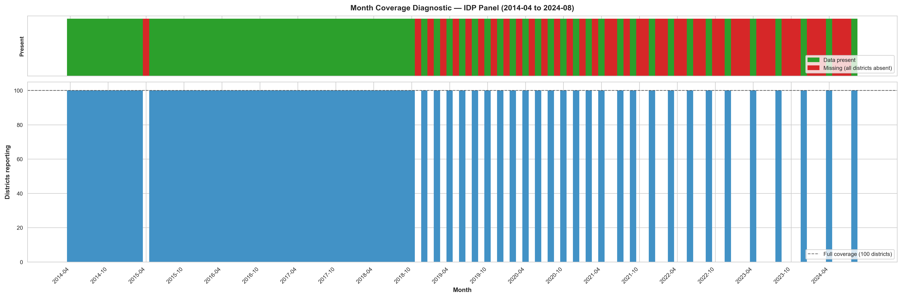
*Coverage diagnostic for the district-month panel from April 2014 to August 2024. The top panel shows whether usable data are present in each month, while the bottom panel shows the number of reporting districts by month. This figure documents the months excluded from the estimation sample because no usable data are available across districts.*

**Figure A1: Population Displacements — Linear vs. Logarithmic Scale**
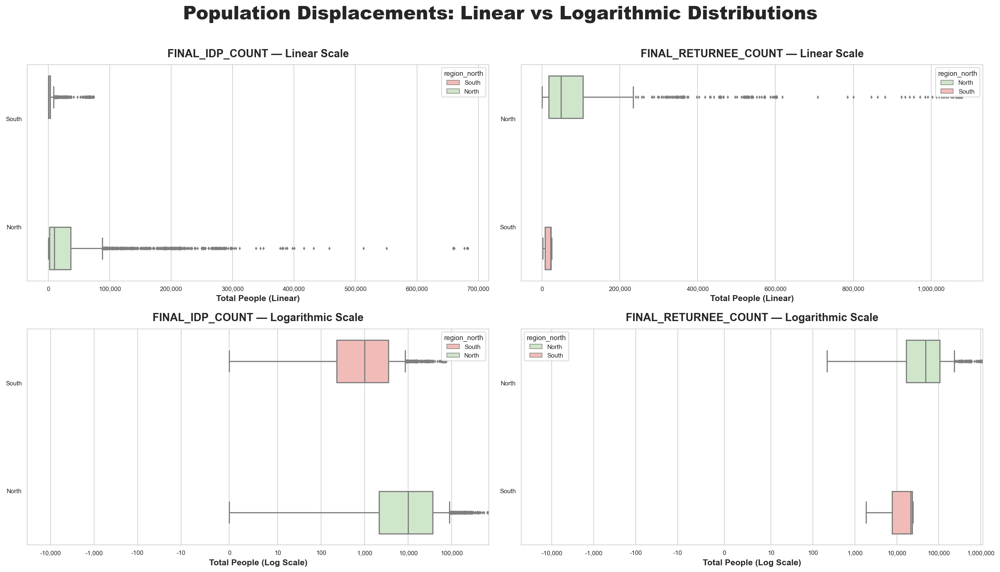
*Boxplots of IDP and returnee counts by North/South on linear (top) and symlog (bottom) scales.*

**Figure A2: Environmental and Economic Shock Distributions by Region**
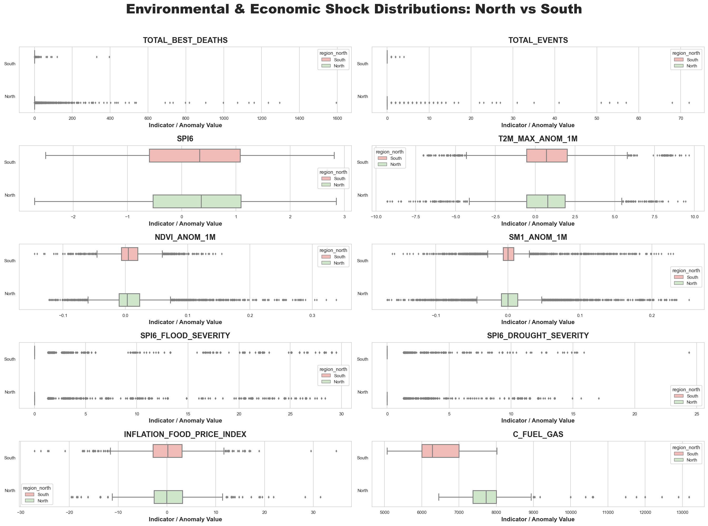
*Regional boxplots for SPI-6, temperature, NDVI, soil moisture, food inflation, fuel price.*

**Figure A3: IDP Monthly Change — North vs South**
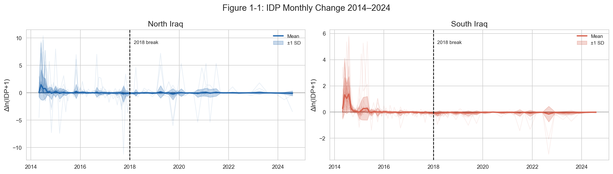
*Mean $\Delta\ln(\mathrm{IDP}+1)$ with $\pm 1$ SD band. Volatile outflows 2014–2016 in North; more symmetric fluctuation in South.*

**Figure A4: Lag Window Selection — Bivariate |t-statistic| Heatmap**
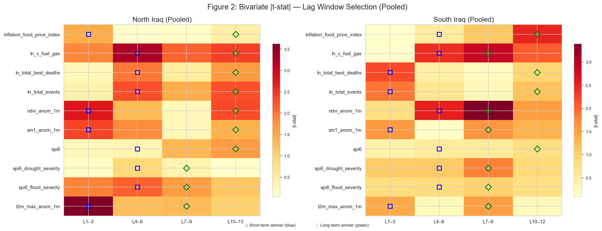
*Maximum |t-statistic| from bivariate Stage A regressions for each variable × lag window (pooled, own lags only).*

**Figure A5: Climate Thematic Heatmaps — North vs South**

*SPI-6, temperature anomaly, NDVI anomaly by district and month.*

**Figure A6: Price Thematic Heatmaps — North vs South**

*Wage, fuel price, food inflation by district and month.*

**Figure A7: Model-Column Correlations — North Iraq**

**Figure A8: Model-Column Correlations — South Iraq**

*These matrices compare the exact short/long and own/spatial columns considered during specification design. They motivate retaining spatial terms for conflict while using own-district climate and economic exposures in the main model.*

---

## Appendix B. Robustness Figures

**Figure B1: Conflict Coefficient Stability — Pooled Sample**

**Figure B2: Climate Coefficient Stability — Pooled Sample**

**Figure B3: Economic Coefficient Stability — Pooled Sample**

**Figure B4: Random-Forest Nonlinearity Scores — North Iraq**

**Figure B5: Random-Forest Nonlinearity Scores — South Iraq**

**Figure B6: Partial Dependence Diagnostics — North Iraq**

**Figure B7: Partial Dependence Diagnostics — South Iraq**

---

## Appendix C. Spatial Connectivity

**Figure C1–C3: Travel-Time Spatial Connectivity from Key Districts**
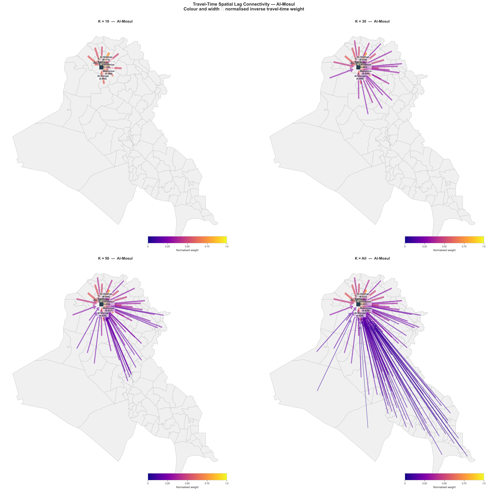
*Al-Mosul: connectivity at $K=10,30,50,\mathrm{ALL}$. Arrow width and color = normalized inverse travel-time weight.*

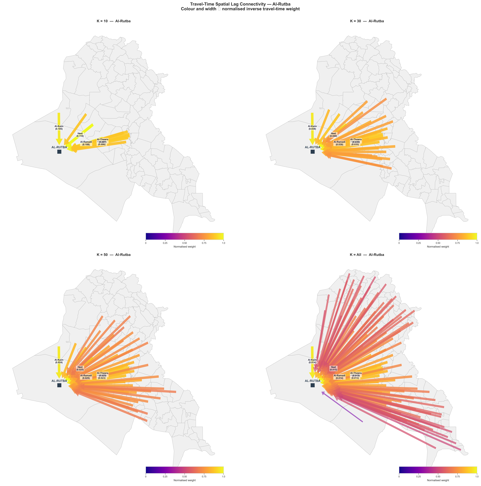
*Al-Rutba: remote western district; sparse connectivity.*

*Al-Basrah: southern hub; dense connectivity across the South.*

---

## Appendix D. Full Statistical Tables

**Table A1.** Full descriptive statistics — `summary_stats_north_south_2014_present.csv`

**Table A2.** Pooled multivariate regression table — `tables/full_multivariate_pooled.csv`

**Table A3.** Pre-2018 multivariate regression table — `tables/full_multivariate_pre2018.csv`

**Table A4.** Post-2018 multivariate regression table — `tables/full_multivariate_post2018.csv`

**Table A5.** Tidy M3 coefficient file for all regions, samples, and outcomes — `tables/full_multivariate_coefficients_tidy.csv`

**Table A6.** RF nonlinearity diagnostics — `rf_nonlinearity_score_all_regions.csv`

**Table A7.** RF interaction nominations — `rf_h_stat_candidates_all_regions.csv`

---

